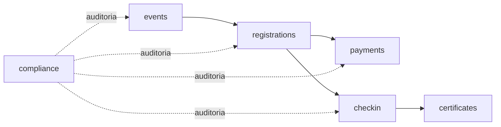
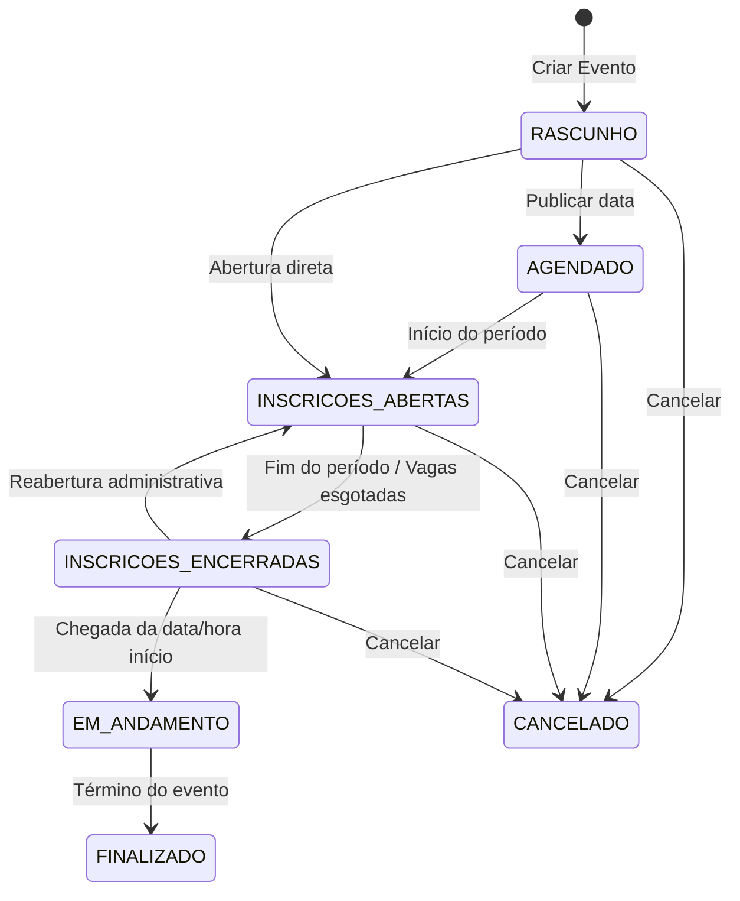
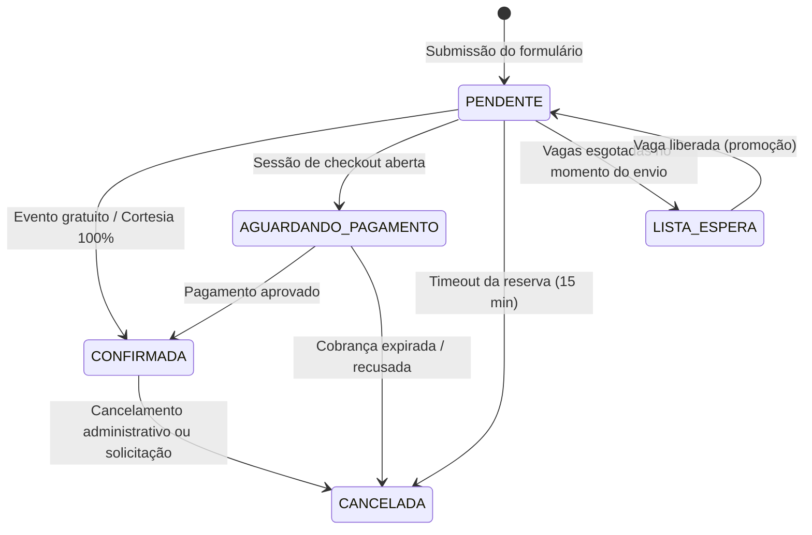

# Geral
Empresa: Rarotec
Sistema: RaroTickets

# Regras de Negócio

> **AVISO OBRIGATÓRIO PARA AGENTES DE DESENVOLVIMENTO:**  
> Este documento trata **EXCLUSIVAMENTE das regras de negócio do sistema**.  
> As decisões de arquitetura de software, padrões de código e camadas estão definidas em [ARCHITECTURE.md](ARCHITECTURE.md).  
> Os padrões de interface visual, tokens e layout estão definidos em [design-system.md](design-system.md).  
> As diretrizes de autenticação, SSO e sessões estão definidas em [authentication.md](authentication.md).  
> Não altere decisões técnicas ou visuais com base neste documento. Em caso de conflito, este documento é a fonte da verdade para **regras de negócio**.

---

## Sumário

1. [Princípios e Bounded Contexts](#1-princípios-e-bounded-contexts)
2. [Contexto 1: Gestão de Eventos e Lotes (`events`)](#2-contexto-1-gestão-de-eventos-e-lotes-events)
   - [2.1 Informações e Configurações do Evento](#21-informações-e-configurações-do-evento)
   - [2.2 Ciclo de Vida e Máquina de Estados do Evento](#22-ciclo-de-vida-e-máquina-de-estados-do-evento)
   - [2.3 Lotes e Precificação Dinâmica](#23-lotes-e-precificação-dinâmica)
   - [2.4 Programação e Palestrantes](#24-programação-e-palestrantes)
3. [Contexto 2: Inscrições, Vagas e Participantes (`registrations`)](#3-contexto-2-inscrições-vagas-e-participantes-registrations)
   - [3.1 Cadastro do Participante](#31-cadastro-do-participante)
   - [3.2 Formulário Dinâmico e Snapshot de Respostas](#32-formulário-dinâmico-e-snapshot-de-respostas)
   - [3.3 Controle de Capacidade e Reserva Temporária de Vagas](#33-controle-de-capacidade-e-reserva-temporária-de-vagas)
   - [3.4 Ciclo de Vida e Máquina de Estados da Inscrição](#34-ciclo-de-vida-e-máquina-de-estados-da-inscrição)
   - [3.5 Lista de Espera](#35-lista-de-espera)
4. [Contexto 3: Pagamentos com PagBank em Popup/Modal (`payments`)](#4-contexto-3-pagamentos-com-pagbank-em-popupmodal-payments)
   - [4.1 Modelo de Checkout Externo via PagBank (Popup / Lightbox)](#41-modelo-de-checkout-externo-via-pagbank-popup--lightbox)
   - [4.2 Referência Unívoca e Ciclo do Pagamento](#42-referência-unívoca-e-ciclo-do-pagamento)
   - [4.3 Tabela De-Para de Status PagBank para Domínio Interno](#43-tabela-de-para-de-status-pagbank-para-domínio-interno)
   - [4.4 Idempotência, Webhooks e Reconciliação](#44-idempotência-webhooks-e-reconciliação)
   - [4.5 Cupons e Cortesias](#45-cupons-e-cortesias)
   - [4.6 Cancelamentos Financeiros e Estornos](#46-cancelamentos-financeiros-e-estornos)
   - [4.7 Requisitos Técnicos e Preparação para Integração PagBank](#47-requisitos-técnicos-e-preparação-para-integração-pagbank)
5. [Contexto 4: Acreditação, Check-in e Presença (`checkin`)](#5-contexto-4-acreditação-check-in-e-presença-checkin)
   - [5.1 Credencial e QR Code](#51-credencial-e-qr-code)
   - [5.2 Regras de Check-in e Validação](#52-regras-de-check-in-e-validação)
6. [Contexto 5: Certificação (`certificates`)](#6-contexto-5-certificação-certificates)
   - [6.1 Elegibilidade e Emissão](#61-elegibilidade-e-emissão)
   - [6.2 Autenticidade e Consulta Pública](#62-autenticidade-e-consulta-pública)
7. [Contexto 6: Acessos, Auditoria e LGPD (`compliance`)](#7-contexto-6-acessos-auditoria-e-lgpd-compliance)
   - [7.1 Perfis de Acesso e Permissões (RaroNexus)](#71-perfis-de-acesso-e-permissões-raronexus)
   - [7.2 Trilha de Auditoria Obrigatória](#72-trilha-de-auditoria-obrigatória)
   - [7.3 LGPD e Gestão de Consentimentos](#73-lgpd-e-gestão-de-consentimentos)
8. [Contexto 7: Notificações e Rotinas Automáticas (`jobs`)](#8-contexto-7-notificações-e-rotinas-automáticas-jobs)
   - [8.1 Disparos de Comunicação](#81-disparos-de-comunicação)
   - [8.2 Rotinas de Expiração Automática](#82-rotinas-de-expiração-automática)
9. [Contexto 8: Consultas, Relatórios e Métricas](#9-contexto-8-consultas-relatórios-e-métricas)
   - [9.1 Área do Participante](#91-área-do-participante)
   - [9.2 Relatórios e Indicadores Operacionais](#92-relatórios-e-indicadores-operacionais)
10. [Apêndice: Matriz de Invariantes e Cenários BDD Críticos](#10-apêndice-matriz-de-invariantes-e-cenários-bdd-críticos)

---

## 1. Princípios e Bounded Contexts

O **RaroTickets** é um ecossistema de gestão de eventos corporativos, treinamentos e congressos públicos ou privados.

### 1.1 Princípios de Domínio
1. **Rastreabilidade Ponta a Ponta**: Toda ação que altera estado do evento, participante, vaga ou financeiro deve ser imutável e auditável.
2. **Desacoplamento de Dados Sensíveis de Pagamento**: O sistema **não** coleta, valida ou armazena números de cartão de crédito, CVV ou códigos bancários internos. Todo o pagamento é delegado ao **PagBank** através de popup/modal externo ou janela segura (Hosted Checkout). O RaroTickets atua apenas iniciando a cobrança com sua referência interna e recebendo a confirmação posterior do pagamento.
3. **Idempotência**: Nenhuma ação disparada externamente (notificações de provedores de pagamento, múltiplos cliques do usuário) pode provocar duplicação de dados, cobranças repetidas ou corrupção de vagas.
4. **Isomorfismo e Validações de Domínio**: Regras de negócio vivem no Domínio e utilizam o *Result Pattern* para tratamento de falhas previsíveis.



---

## 2. Contexto 1: Gestão de Eventos e Lotes (`events`)

### 2.1 Informações e Configurações do Evento
- **RN-EVT-01 (Dados Obrigatórios)**: Todo evento deve possuir título, descrição, período (data/hora de início e término), modalidade (presencial ou online), responsável, tipo financeiro (`GRATUITO` ou `PAGO`) e status inicial.
- **RN-EVT-02 (Localização)**: Eventos presenciais devem obrigatoriamente possuir endereço, município e UF. Eventos online devem possuir link de transmissão (visível aos participantes apenas após confirmação da inscrição).
- **RN-EVT-03 (Período Válido)**: A data de término deve ser posterior ou igual à data de início:
  $$\text{DataTermino} \ge \text{DataInicio}$$

### 2.2 Ciclo de Vida e Máquina de Estados do Evento



| Status Origem | Transição Permitida | Gatilho / Condição |
| :--- | :--- | :--- |
| `RASCUNHO` | `AGENDADO` ou `INSCRICOES_ABERTAS` | Ação administrativa de publicação |
| `AGENDADO` | `INSCRICOES_ABERTAS` | Chegada da data de abertura de inscrições |
| `INSCRICOES_ABERTAS` | `INSCRICOES_ENCERRADAS` | Fim do prazo de inscrições ou esgotamento de vagas (sem lista de espera) |
| `INSCRICOES_ENCERRADAS` | `EM_ANDAMENTO` | Início oficial da programação do evento |
| `EM_ANDAMENTO` | `FINALIZADO` | Conclusão oficial do evento |
| Qualquer estado pré-finalizado | `CANCELADO` | Ação administrativa de cancelamento (exige justificativa) |

- **RN-EVT-04 (Bloqueio de Inscrições)**: Em `RASCUNHO`, `INSCRICOES_ENCERRADAS`, `EM_ANDAMENTO`, `FINALIZADO` e `CANCELADO`, é terminantemente proibida a criação pública de novas inscrições.

### 2.3 Lotes e Precificação Dinâmica
- **RN-LOT-01 (Estrutura de Lote)**: Eventos pagos possuem um ou mais lotes com: nome, valor nominal ($\text{Valor} > 0$), período de vigência (data início e término), quantidade máxima de vagas e indicador de ativo/inativo.
- **RN-LOT-02 (Elegibilidade do Lote Vigente)**: O sistema identifica automaticamente o lote aplicável à inscrição considerando:
  $$\text{LoteVigente} = \{ l \mid l.\text{ativo} = \text{true} \land (l.\text{inicio} \le \text{now}() \le l.\text{fim}) \land (l.\text{vagasRestantes} > 0) \}$$
- **RN-LOT-03 (Transição Automática de Lote)**: Quando um lote encerra por data ou por esgotamento de suas vagas, o lote subsequente em ordem cronológica torna-se ativo imediatamente.
- **RN-LOT-04 (Imutabilidade do Preço Contratado)**: O valor do lote vinculado a uma inscrição pendente ou confirmada é registrado como snapshot imutável. Alterações posteriores no preço do lote não retroagem sobre inscrições já criadas.

### 2.4 Programação e Palestrantes
- **RN-EVT-05 (Atividades)**: Um evento pode conter múltiplas atividades programadas, contendo: título, horário de início/término, descrição, local/sala e palestrantes vinculados.

---

## 3. Contexto 2: Inscrições, Vagas e Participantes (`registrations`)

### 3.1 Cadastro do Participante
- **RN-PAR-01 (Identidade Única)**: O participante possui cadastro próprio e desacoplado de eventos específicos, identificado unicamente por CPF (ou Passaporte para estrangeiros) e E-mail.
- **RN-PAR-02 (Reutilização de Cadastro)**: Um participante pode se inscrever em múltiplos eventos sem duplicar seu cadastro base no sistema.

### 3.2 Formulário Dinâmico e Snapshot de Respostas
- **RN-FRM-01 (Formulário por Evento)**: Cada evento pode possuir campos customizados adicionais (ex.: Órgão público, cargo, necessidades especiais, arquivos anexos).
- **RN-FRM-02 (Snapshot de Respostas)**: No momento em que a inscrição é submetida, as respostas fornecidas são congeladas em um snapshot imutável vinculado à inscrição. Modificações ou exclusões posteriores de campos no formulário do evento **não** alteram nem corrompem as respostas prévias.

### 3.3 Controle de Capacidade e Reserva Temporária de Vagas
- **RN-RES-01 (Fórmula de Capacidade)**: A quantidade de vagas disponíveis em um evento é calculada por:
  $$\text{VagasDisponiveis} = \text{CapacidadeMaxima} - (\text{InscricoesConfirmadas} + \text{ReservasAtivas})$$
- **RN-RES-02 (Invariante de Não-Superlotação)**: O sistema deve impedir que a concorrência entre solicitações simultâneas resulte em *overbooking*:
  $$\text{VagasDisponiveis} \ge 0$$
- **RN-RES-03 (Reserva Temporária de Vaga - Lock de Checkout)**: Ao submeter o formulário de um evento pago com vaga disponível, o sistema cria uma **reserva temporária de vaga** com validade de 15 minutos (`reserva_expira_em = now() + 15 min`).
- **RN-RES-04 (Expiração de Reserva)**: Caso a confirmação de pagamento não seja recebida até `reserva_expira_em`, a reserva expira automaticamente, a vaga retorna imediatamente ao pool disponível e a inscrição transiciona para `CANCELADA` (motivo: `TIMEOUT_RESERVA`).
- **RN-RES-05 (Concorrência Atômica)**: A alocação da vaga/reserva deve ocorrer com bloqueio transacional atômico no banco de dados para eliminar *race conditions*.

### 3.4 Ciclo de Vida e Máquina de Estados da Inscrição



| Estado Origem | Gatilho / Evento | Estado Destino | Regra de Domínio |
| :--- | :--- | :--- | :--- |
| `PENDENTE` | Submissão em evento gratuito | `CONFIRMADA` | Confirmação imediata se houver vaga |
| `PENDENTE` | Inicia checkout em evento pago | `AGUARDANDO_PAGAMENTO` | Reserva temporária ativa |
| `PENDENTE` | Fim do tempo de reserva (15 min) | `CANCELADA` | Libera vaga de volta ao evento |
| `AGUARDANDO_PAGAMENTO` | Notificação de pagamento aprovado | `CONFIRMADA` | Vaga torna-se definitivamente ocupada |
| `AGUARDANDO_PAGAMENTO` | Cobrança expirada sem pagamento | `CANCELADA` | Libera vaga; permite nova tentativa |
| `CONFIRMADA` | Solicitação formal de cancelamento | `CANCELADA` | Libera vaga; avalia eventual estorno |
| `LISTA_ESPERA` | Promoção de vaga liberada | `PENDENTE` | Gera nova reserva temporária para o participante |

- **RN-INS-01 (Código Identificador Único)**: Toda inscrição recebe um identificador único alfanumérico legível e seguro (ex.: `INS-2026-X89F2A`).

### 3.5 Lista de Espera
- **RN-ESP-01 (Ativação)**: Quando $\text{VagasDisponiveis} = 0$, inscrições públicas subsequentes podem ingressar na `LISTA_ESPERA` (se habilitada no evento).
- **RN-ESP-02 (Não Ocupação de Vaga)**: Inscrições em `LISTA_ESPERA` não ocupam capacidade do evento nem geram cobrança financeira.
- **RN-ESP-03 (Promoção)**: Quando uma vaga é liberada (por cancelamento ou expiração), o primeiro participante da lista de espera pode ser promovido para `PENDENTE`, recebendo notificação para concluir o pagamento em prazo delimitado.

---

## 4. Contexto 3: Pagamentos com PagBank em Popup/Modal (`payments`)

### 4.1 Modelo de Checkout Externo via PagBank (Popup / Lightbox)
- **RN-PAG-01 (Provedor Oficial PagBank)**: O provedor oficial de integração de pagamentos do sistema é o **PagBank** (PagSeguro). O pagamento é executado através de popup/modal externo (Lightbox / Checkout PagBank) ou janela segura oficial fornecida pelo PagBank.
- **RN-PAG-02 (Papel do Sistema: Apenas Iniciação e Confirmação)**: O sistema RaroTickets atua exclusivamente como originador da cobrança e receptor da confirmação. Ao clicar em realizar pagamento, o sistema gera a ordem no PagBank e abre o popup/modal oficial. O RaroTickets aguarda apenas a notificação de confirmação financeira para validar a inscrição.
- **RN-PAG-03 (Zero Retenção de Dados Sensíveis)**: O sistema **nunca** coleta, processa ou armazena números de cartão de crédito, CVV ou credenciais bancárias do participante. O participante digita seus dados estritamente dentro do ambiente protegido e certificado do PagBank.
- **RN-PAG-04 (Métodos Oferecidos pelo PagBank no Popup)**: O popup oficial do PagBank oferece as opções configuradas:
  - **PIX** (com geração do QR Code e código copia-e-cola diretamente na interface do PagBank);
  - **Cartão de Crédito** (com parcelamento gerido pelas regras do evento e análise de risco própria do PagBank);
  - **Boleto Bancário** (com emissão e instruções sob responsabilidade do PagBank).

### 4.2 Referência Unívoca e Ciclo do Pagamento
- **RN-PAG-05 (Identificador Externo Unívoco - Reference ID)**: Toda requisição de criação de cobrança/ordem enviada ao PagBank deve receber o identificador único da inscrição no campo de referência interna:
  $$\text{reference\_id} = \text{inscricaoId}$$
- **RN-PAG-06 (Prevenção de Cobranças Duplicadas)**: Antes de abrir uma nova sessão de pagamento no PagBank, o sistema verifica se já existe uma sessão/ordem aberta e válida para a mesma inscrição, reutilizando-a se estiver dentro da validade.

### 4.3 Tabela De-Para de Status PagBank para Domínio Interno
Para manter a independência arquitetural e isolamento do domínio, os status recebidos da API do PagBank são convertidos para os status internos de domínio:

| Status Oficial PagBank | Status Interno do Pagamento | Efeito na Inscrição | Impacto na Vaga |
| :--- | :--- | :--- | :--- |
| `WAITING_PAYMENT`, `IN_ANALYSIS`, `AUTHORIZED` | `AGUARDANDO` | Permanece `AGUARDANDO_PAGAMENTO` | Reserva de 15 min mantida |
| `PAID`, `AUTHORIZED_AND_CAPTURED` | `PAGO` | Transiciona para `CONFIRMADA` | Vaga definitiva confirmada |
| `DECLINED`, `REJECTED` | `RECUSADO` | Permanece `AGUARDANDO_PAGAMENTO` (permite retry) | Reserva mantida até expirar |
| `CANCELED` | `CANCELADO` | Transiciona para `CANCELADA` | Vaga liberada |
| `EXPIRED` | `EXPIRADO` | Transiciona para `CANCELADA` | Vaga liberada |
| `REFUNDED` | `ESTORNADO` | Mantém registro; avalia cancelamento de inscrição | Vaga liberada se cancelada |

### 4.4 Idempotência, Webhooks e Reconciliação
- **RN-PAG-07 (Idempotência Estrita no Webhook)**: O endpoint que recebe notificações assíncronas do PagBank deve ser idempotente. Processar o mesmo webhook repetidas vezes não pode duplicar confirmações, disparar notificações redundantes ou corromper a contagem de vagas.
- **RN-PAG-08 (Armazenamento de Notificações)**: Toda notificação recebida do PagBank é armazenada integralmente (payload bruto, timestamp e headers de autenticidade) para auditoria e conferência.
- **RN-PAG-09 (Reconciliação Financeira Ativa)**: O sistema não depende exclusivamente de webhooks. Uma rotina de background consulta periodicamente a API de ordens do PagBank para checar cobranças em situação `AGUARDANDO`, tratando eventuais instabilidades ou falhas de envio de notificações.
- **RN-PAG-10 (Tratamento de Pagamento Tardio)**: Se uma notificação de pagamento aprovado do PagBank chegar após a expiração da reserva:
  - Se ainda houver vagas disponíveis no evento: a inscrição é confirmada e a vaga é alocada definitivamente.
  - Se as vagas estiverem esgotadas: o sistema registra o pagamento como `ESTORNO_NECESSARIO`, alerta o operador financeiro para realizar o estorno no PagBank e posiciona a inscrição como cancelada ou em lista de espera.

### 4.5 Cupons e Cortesias
- **RN-PAG-11 (Tipos de Cupom)**: O sistema suporta cupons de desconto dos tipos:
  - `PERCENTUAL` (desconto percentual sobre o valor do lote);
  - `VALOR_FIXO` (abatimento em Reais);
  - `CORTESIA` (100% de desconto).
- **RN-PAG-12 (Invariante de Valor Final)**: O valor final a pagar nunca pode ser negativo:
  $$\text{ValorFinal} = \max\left(0, \text{ValorLote} - \text{ValorDesconto}\right)$$
- **RN-PAG-13 (Cortesias / Valor Zero)**: Quando $\text{ValorFinal} = 0$ (por cupom ou concessão administrativa), a etapa de abertura de popup do PagBank é dispensada, confirmando-se a inscrição diretamente no domínio.

### 4.6 Cancelamentos Financeiros e Estornos
- **RN-PAG-14 (Separação de Operações)**: Cancelamento de inscrição e cancelamento/estorno financeiro junto ao PagBank são operações distintas e independentes.
- **RN-PAG-15 (Imutabilidade de Registros Financeiros)**: Nenhum pagamento é apagado do banco de dados. Estornos e cancelamentos geram novos registros de evento financeiro com rastreabilidade de operador, valor e motivo.

### 4.7 Requisitos Técnicos e Preparação para Integração PagBank

Para que a integração em popup com o PagBank opere em produção e homologação, os seguintes requisitos e credenciais devem ser providenciados junto ao PagBank:

#### 4.7.1 Credenciais e Parâmetros Necessários (A preencher futuramente)
1. **Conta Comercial PagBank**: Conta jurídica ou pessoa física verificada e apta para emissão de cobranças online.
2. **Ambiente e Chaves de API**:
   - `PAGBANK_ENV`: Ambiente ativo (`sandbox` ou `production`).
   - `PAGBANK_BASE_URL`: URL base da API oficial v4 (`https://sandbox.api.pagseguro.com` ou `https://api.pagseguro.com`).
   - `PAGBANK_TOKEN`: Token de autenticação Bearer da API oficial v4.
   - `PAGBANK_PUBLIC_KEY`: Chave pública para utilização do SDK de checkout/popup do PagBank no frontend, caso aplicável.
3. **Webhook e Segurança**:
   - `PAGBANK_WEBHOOK_URL`: Endpoint exposto pelo sistema para recepção das notificações (`${APP_BASE_URL}/api/v1/payments/webhooks/pagbank`).
   - `PAGBANK_WEBHOOK_SECRET`: Chave ou assinatura de autenticação para validar a procedência dos webhooks recebidos do PagBank.
4. **URLs de Retorno**:
   - Redirecionamento em caso de conclusão no popup: `${APP_BASE_URL}/inscricao/[id]/sucesso`.
   - Redirecionamento em caso de cancelamento/falha: `${APP_BASE_URL}/inscricao/[id]/pagamento`.

#### 4.7.2 Diretrizes de Preparação para o Agente de Desenvolvimento
Mesmo antes do fornecimento das credenciais reais acima, o agente de desenvolvimento **DEVE preparar toda a arquitetura de suporte**:
1. **Porta de Domínio Agnóstica**: Manter a interface `PaymentGatewayPort` (ou `PagBankGatewayPort`) no módulo de pagamentos, contendo métodos para criar ordem de pagamento em popup (`createCheckoutSession`), consultar status (`getPaymentStatus`), processar webhook (`parseWebhookNotification`) e solicitar estorno (`refundPayment`).
2. **Adapter Mock/Fake**: Criar um `MockPagBankPaymentGatewayAdapter` (ou `InMemoryPaymentGatewayAdapter`) que simula a abertura do popup e a recepção de webhooks para testes unitários, de integração e desenvolvimento local sem necessidade de credenciais ativas.
3. **Contrato de Variáveis de Ambiente**: Declarar todos os parâmetros acima no arquivo `.env.example` com comentários claros.
4. **Acoplamento Zero**: Garantir que as regras de negócio de inscrição, vagas e eventos não façam chamadas HTTP diretas nem importem SDKs do PagBank — toda a comunicação deve passar estritamente pela porta de domínio. Quando os requisitos do PagBank forem preenchidos, bastará implementar o adapter de infraestrutura real.

---

## 5. Contexto 4: Acreditação, Check-in e Presença (`checkin`)

### 5.1 Credencial e QR Code
- **RN-CHK-01 (Emissão da Credencial)**: O participante só tem acesso à sua credencial/QR Code após a inscrição estar no status `CONFIRMADA`.
- **RN-CHK-02 (Segurança do QR Code)**: O payload do QR Code não deve expor IDs sequenciais previsíveis do banco de dados. Deve conter um token opaco assinado (ex.: UUIDv4 ou token criptográfico com HMAC) validável no momento da leitura.

### 5.2 Regras de Check-in e Validação
- **RN-CHK-03 (Pré-condições para Check-in)**: O check-in só é validado se:
  1. A inscrição estiver `CONFIRMADA`;
  2. O evento estiver no status `EM_ANDAMENTO` ou no dia da realização;
  3. Não existir check-in já registrado para aquela inscrição.
- **RN-CHK-04 (Prevenção de Duplicidade)**: Leituras subsequentes do mesmo QR Code devem ser rejeitadas pelo sistema, exibindo alerta de *"Check-in já realizado"* com data, hora e responsável pela leitura original.
- **RN-CHK-05 (Reentrada Administrativa)**: Em caso de necessidade operacional de reentrada, a liberação exige autorização de usuário com perfil adequado e registro de justificativa em auditoria.

---

## 6. Contexto 5: Certificação (`certificates`)

### 6.1 Elegibilidade e Emissão
- **RN-CRT-01 (Configuração do Certificado)**: O evento define se há emissão de certificado, carga horária associada, template e regras de presença mínima (ex.: presença confirmada no check-in).
- **RN-CRT-02 (Invariante de Elegibilidade)**: Um certificado só pode ser emitido se o evento estiver `FINALIZADO` e o participante tiver sua presença devidamente confirmada no check-in.
- **RN-CRT-03 (Imutabilidade do Certificado)**: Uma vez emitido, os dados do certificado (nome do participante, carga horária, data e título do evento) tornam-se imutáveis.

### 6.2 Autenticidade e Consulta Pública
- **RN-CRT-04 (Código Autenticador Único)**: Todo certificado emitido possui um código alfanumérico único de validação e um QR Code de verificação.
- **RN-CRT-05 (Validação Pública)**: O sistema deve disponibilizar página pública onde qualquer terceiro pode digitar o código ou escanear o QR Code para comprovar a autenticidade e os dados do certificado emitido.

---

## 7. Contexto 6: Acessos, Auditoria e LGPD (`compliance`)

### 7.1 Perfis de Acesso e Permissões (RaroNexus)
Conforme definido em [authentication.md](authentication.md), o sistema autentica usuários via SSO no **RaroNexus**. O RaroTickets mapeia as roles retornadas para os perfis locais de autorização:

| Perfil Interno | Responsabilidades / Permissões no RaroTickets |
| :--- | :--- |
| `ADMINISTRADOR` | Gestão total de eventos, configurações globais, cancelamentos e estornos |
| `GERENTE_EVENTO`| Criação, edição e publicação de seus eventos; gestão de lotes e lista de espera |
| `FINANCEIRO` | Visualização de relatórios financeiros, reconciliação e autorização de estornos |
| `ATENDIMENTO` | Consulta de participantes, reenvio de comprovantes e cortesias autorizadas |
| `CHECKIN` | Leitura de QR Codes e confirmação de presença na portaria do evento |
| `CONSULTA` | Acesso somente-leitura a relatórios e métricas operacionais |

### 7.2 Trilha de Auditoria Obrigatória
- **RN-AUD-01 (Ações Rastreadas)**: Devem gerar registro de auditoria imutável:
  - Criação, alteração de status ou cancelamento de eventos;
  - Concessão manual de cortesias ou confirmação forçada de inscrições;
  - Cancelamentos de inscrições e solicitações de estorno financeiro;
  - Realização manual ou desbloqueio de check-in;
  - Alterações de permissões e perfis de usuários.
- **RN-AUD-02 (Dados Mínimos de Auditoria)**: O registro de auditoria deve conter: `usuarioId`, `dataHoraUTC`, `ipOrigem`, `tipoAcao`, `entidadeAfetada`, `idRegistroAfetado`, `estadoAnterior` e `estadoNovo`.

### 7.3 LGPD e Gestão de Consentimentos
- **RN-LGP-01 (Termos e Consentimento)**: O formulário de inscrição deve apresentar de forma clara e granular o aceite aos Termos de Uso e Política de Privacidade.
- **RN-LGP-02 (Não Condicionamento de Marketing)**: O consentimento para envio de comunicações de marketing/promocionais deve ser opt-in independente e **nunca** obrigatório para a conclusão da inscrição.
- **RN-LGP-03 (Direitos do Titular)**: O sistema deve suportar rotinas de anonimização e exportação de dados pessoais mediante requisição formal, resguardando os dados estritamente necessários para obrigações fiscais e auditoria legal.

---

## 8. Contexto 7: Notificações e Rotinas Automáticas (`jobs`)

### 8.1 Disparos de Comunicação
- **RN-JOB-01 (Gatilhos Transacionais)**: O sistema dispara notificações automáticas (E-mail e/ou WhatsApp) nos seguintes eventos:
  1. *Inscrição Criada (Aguardando Pagamento)*: instruções e link para o modal de pagamento;
  2. *Inscrição Confirmada*: envio do comprovante e da credencial/QR Code;
  3. *Pagamento Recusado / Expirado*: aviso e orientações para reabertura de checkout;
  4. *Lembrete do Evento*: enviado 24h a 48h antes do início do evento;
  5. *Certificado Disponível*: aviso após encerramento do evento com link para emissão.

### 8.2 Rotinas de Expiração Automática
- **RN-JOB-02 (Rotina de Expiração de Reservas)**: Job executado a cada minuto para identificar reservas temporárias com `reserva_expira_em < now()`, transicionando as inscrições pendentes para `CANCELADA` e devolvendo as vagas ao pool.
- **RN-JOB-03 (Rotina de Virada de Lotes)**: Job executado periodicamente para ativar lotes que atingiram a data inicial e desativar lotes cuja data final expirou.

---

## 9. Contexto 8: Consultas, Relatórios e Métricas

### 9.1 Área do Participante
- **RN-USR-01 (Painel Pessoal)**: O participante autenticado pode consultar o histórico de todos os eventos em que se inscreveu, status de pagamento, links de transmissão de eventos online, credenciais/QR Codes de check-in e certificados emitidos.

### 9.2 Relatórios e Indicadores Operacionais
- **RN-REP-01 (Indicadores em Tempo Real)**:
  - Total de inscritos (confirmados vs. pendentes vs. lista de espera);
  - Vagas restantes em tempo real;
  - Receita financeira prevista vs. receita efetivamente liquidada;
  - Taxa de comparecimento ($\text{Presenca} / \text{Confirmados} \times 100$).
- **RN-REP-02 (Segmentação)**: Relatórios operacionais agrupados por lote, município, empresa/órgão e canal de inscrição.

---

## 10. Apêndice: Matriz de Invariantes e Cenários BDD Críticos

### 10.1 Resumo das Invariantes Matemáticas do Domínio

| Invariante | Expressão Formal | Violação Resulta em |
| :--- | :--- | :--- |
| **Não Superlotação** | $\text{Confirmadas} + \text{ReservasAtivas} \le \text{CapacidadeMaxima}$ | `Result.fail(DomainError.create('RN-RES-02', 'Vagas esgotadas'))` |
| **Preço Não Negativo** | $\text{PrecoFinal} = \max(0, \text{PrecoLote} - \text{Desconto}) \ge 0$ | `Result.fail(DomainError.create('RN-PAG-12', 'Valor inválido'))` |
| **Check-in Único** | $\text{Count}(\text{CheckInsPorInscricao}) \le 1$ | `Result.fail(DomainError.create('RN-CHK-04', 'Check-in já realizado'))` |
| **Elegibilidade Certificado** | $\text{EventoFinalizado} \land \text{CheckInRealizado} = \text{true}$ | `Result.fail(DomainError.create('RN-CRT-02', 'Participante não elegível'))` |

### 10.2 Cenários BDD de Alta Concorrência

#### Cenário: Concorrência simultânea na última vaga
```gherkin
Cenário: Duas pessoas tentam reservar a última vaga simultaneamente
  Dado que o evento "Reforma Tributária" possui apenas 1 vaga restante
  E nenhum participante possui reserva ativa no momento
  Quando o Participante "A" e o Participante "B" submetem o formulário no mesmo milissegundo
  Então uma das transações adquire o lock atômico e cria a reserva temporária de 15 minutos
  E a outra transação recebe o erro "Vagas esgotadas para este evento"
  E é oferecido ao segundo participante ingressar na LISTA_ESPERA
```

#### Cenário: Idempotência de notificação do PagBank
```gherkin
Cenário: Webhook de pagamento recebido do PagBank em duplicidade
  Dado que a inscrição "INS-100" está com status AGUARDANDO_PAGAMENTO
  Quando o PagBank envia o webhook de pagamento aprovado para a inscrição "INS-100"
  Então o pagamento é marcado como PAGO e a inscrição transiciona para CONFIRMADA
  E o QR Code de credencial é gerado
  Quando o PagBank reenvia a mesma notificação de pagamento aprovado 30 segundos depois
  Então o sistema reconhece a notificação já processada
  E responde HTTP 200 ao PagBank
  E nenhuma transação secundária ou e-mail duplicado é gerado
```